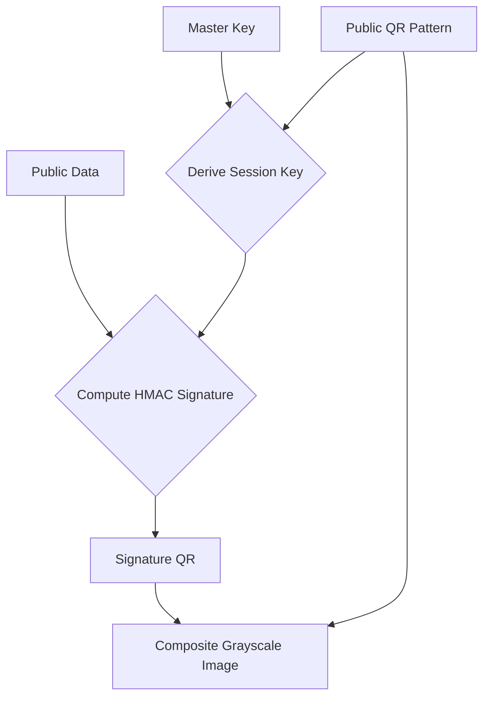

# SecuriQR

[](https://badge.fury.io/py/securiqr)
[](https://pypi.org/project/securiqr/)
[](https://opensource.org/licenses/MIT)
[](https://github.com/psf/black)
[](https://en.wikipedia.org/wiki/Elliptic_Curve_Digital_Signature_Algorithm)
[](https://github.com/Adi-Baba/securiqr)

**Dual-Layer Authenticated Barcode System**

SecuriQR is a Python library for generating and verifying dual-layer, cryptographically signed QR codes. It enhances standard QR codes by embedding a second, hidden layer containing a digital signature, making them resistant to simple duplication and providing a robust method for product authentication.

The core innovation is that the cryptographic key used for the signature is derived from the **visual pattern** of the public-facing QR code itself. This creates a strong link between the physical code and its digital signature, making it a form of a physically unclonable function (PUF).

## How It Works

A SecuriQR code is a composite grayscale image built from two separate QR codes:

1.  **Public Layer:** A standard QR code containing public information (e.g., a product ID, URL). This is the "data" layer.
2.  **Hidden Layer:** A second QR code, invisible to standard scanners, that contains an HMAC-SHA256 signature. This is the "signature" layer.

The two layers are merged into a single image using different shades of gray to represent the modules (pixels) of each code.

The verification process is as follows:

1.  An image of the SecuriQR code is captured.
2.  The image is processed to separate the two underlying QR code patterns.
3.  The public data is read from the first QR code.
4.  The library re-generates the *expected* visual pattern of the public QR code **exactly** as it should have been created.
5.  A session key is derived by hashing the master secret key with this visual pattern.
6.  This session key is used to compute an expected signature for the public data.
7.  The expected signature is compared with the actual signature read from the hidden layer. If they match, the code is authentic.

This process effectively uses the QR code's pattern as a 'physical key'. An attacker cannot simply copy the public data to a new QR code, because the new code's different visual pattern would produce the wrong session key, leading to a signature mismatch.


## Features

- **Strong Authentication:** Uses HMAC-SHA256 signatures to verify authenticity.
- **Physically Unclonable:** The signature is tied to the visual matrix of the QR code, not just the data it contains.
- **Secret Message Embedding:** Securely embed a hidden message that is only revealed upon successful verification.
- **Batch Processing:** Efficiently generate or verify large numbers of codes.
- **Customizable:** Control over QR code version, error correction, and output scale.
- **Pure Python:** Relies on well-established libraries like `Pillow`, `numpy`, and `qrcode`.

## Core Components

- **`SecuriQREngine`**: Using ECC keys, handles both the generation of signed barcodes (Private Key) and verification (Public Key).
- **`CryptoManager`**: Manages ECDSA key generation, loading, and cryptographic operations.
- **`BarcodeDecoder`**: Reads a composite grayscale image, separates the two layers, and decodes the raw public data and signature.

## Installation

First, clone the repository and navigate into the project directory:

```bash
git clone https://github.com/Adi-Baba/securiqr.git
cd securiqr
```

It is recommended to use a virtual environment:

```bash
python -m venv .venv
source .venv/bin/activate  # On Windows use `.venv\Scripts\activate`
```

Install the required dependencies:

```bash
pip install -r requirements.txt
```
*(Note: A `requirements.txt` file would need to be created for this command to work.)*
### 1. Prerequisites (ZBar)
This project depends on `pyzbar`, which requires the native `zbar` library to be installed on your system.

*   **Windows**: 
    *   No action usually required (DLLs included in `pyzbar`).
    *   If you see DLL errors, install the [Visual C++ Redistributable](https://support.microsoft.com/en-us/help/2977003/the-latest-supported-visual-c-downloads).
*   **macOS**:
    ```bash
    brew install zbar
    ```
*   **Linux (Ubuntu/Debian)**:
    ```bash
    sudo apt-get install libzbar0
    ```

### 2. Install Package
You can install SecuriQR directly from GitHub:

```bash
pip install git+https://github.com/Adi-Baba/securiqr.git
```
Or if you have properly cloned it locally:
```bash
pip install .
```

## Quick Usage

> **⚠️ Google Colab / Jupyter Notebook Users:**  
> When running these commands in a notebook cell, you must add an exclamation mark `!` at the beginning.  
> Example: `!securiqr-gen ...`

SecuriQR installs three command-line tools:

### Generate Keys
First, generate your ECDSA key pair (Private/Public keys).
```python
from securiqr.core.crypto import CryptoManager
cm = CryptoManager()
cm.generate_key_pair("keys")
```

### Generate Code
Create a secure barcode signed with your **Private Key**.
```bash
securiqr-gen "Product-123" -s "SecretFabricData" -k keys/private.pem
```

### Verify Code
Verify a barcode using the **Public Key**. safe for distribution to field agents.
```bash
securiqr-verify output/composite_barcode.png -k keys/public.pem
```

### Universal Reader
Read standard QR codes or SecuriQR codes.
```bash
securiqr-read path/to/image.png -k keys/public.pem
```    
## Basic Usage

The following example demonstrates the end-to-end process of generating a SecuriQR code, saving it, and then verifying its authenticity.

```python
import os
from pathlib import Path

# Assuming the library is in the python path
```python
import os
from pathlib import Path

# Assuming the library is in the python path
from securiqr.core.engine import SecuriQREngine
from securiqr.core.crypto import CryptoManager
from securiqr.processing.decoder import BarcodeDecoder

def main():
    """Generate and verify a SecuriQR barcode."""
    
    # 1. Setup
    output_dir = Path("output")
    output_dir.mkdir(exist_ok=True)
    keys_dir = Path("keys")
    
    # We need keys first!
    if not keys_dir.exists():
        print("Generating new keys...")
        cm = CryptoManager()
        cm.generate_key_pair(str(keys_dir))

    private_key_path = keys_dir / "private.pem"
    public_key_path = keys_dir / "public.pem"
    barcode_path = output_dir / "my_product_barcode.png"
    
    # Initialize Engine with Private Key for Generation
    engine_gen = SecuriQREngine(str(private_key_path))
    decoder = BarcodeDecoder()
    
    # 2. Generation
    public_data = "Product ID: SKU-12345"
    secret_message = "This is a genuine product, batch #42"
    
    print(f"Generating barcode for: {public_data}")
    
    # Create the in-memory barcode data and its visual matrix
    barcode, data_matrix, version, ec, mask = engine_gen.create_barcode(
        public_data, secret_message
    )
    
    # Generate and save the final composite grayscale image
    engine_gen.generate_composite_barcode(
        barcode, data_matrix, str(barcode_path), version, ec, mask
    )
    
    print(f"Barcode saved to: {barcode_path}\n")
    
    # 3. Verification
    print("Attempting to verify the generated barcode...")
    
    # Decode the composite image to extract barcode data
    result = decoder.read_composite_barcode(str(barcode_path))
    if not result:
        print("❌ Verification failed: Could not decode the barcode.")
        return

    decoded_barcode, _ = result
    
    # Initialize Engine with PUBLIC Key for Verification
    # (In a real app, the client only has the public key)
    engine_ver = SecuriQREngine(str(public_key_path))

    # Verify the authenticity of the decoded data
    is_authentic = engine_ver.verify_barcode(decoded_barcode)
    
    if is_authentic:
        print("✅ Barcode is AUTHENTIC.")
        # Extract the secret message from the verified code
        secret = engine_ver.extract_secret_message(decoded_barcode)
        print(f"   Secret message: '{secret}'")
    else:
        print("❌ Barcode is NOT authentic.")

if __name__ == "__main__":
    main()
`````

## Advanced Usage

The `examples/advanced_usage.py` script demonstrates more complex scenarios, including:
- Batch processing of multiple products.
- Detailed logging to a file.
- Structured results for generation and verification steps.

## Contributing

Contributions are welcome! Please feel free to submit a pull request or open an issue for bugs, feature requests, or questions.

## License

This project is licensed under the MIT License - see the LICENSE file for details.